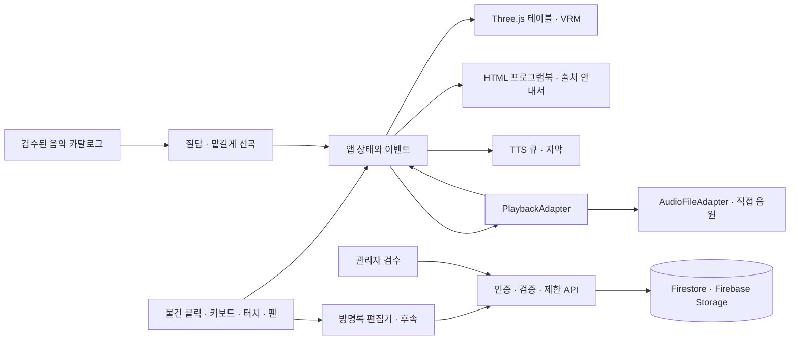

# Classic BGM DJ 3D — 세실리아의 음악 응접실

작성일: 2026-09-12 · 버전: 0.3 · 상태: 단계 0 완료

## 1. 제품 방향

고급스러운 응접실에 들어서면 VRM 집사 세실리아이 인사를 건넨다. 방문자는 몇 가지 취향을 고르거나 “맡길게”를 누르고 음악을 듣는다. 테이블 위 축음기, 펼쳐진 공연 프로그램북, 두꺼운 출처 안내서, 손글씨 방명록을 직접 조작한다.

3D 공간의 분위기와 실제로 읽고 쓰기 편한 인터페이스를 함께 제공한다. PC·태블릿·휴대폰·전자칠판에서 동일한 음악과 기록을 이용하되, 기기에 따라 카메라와 책자 배치를 바꾼다. 기본 언어는 한국어이며 곡 원제와 작곡가 원어명은 함께 표시한다.

### 확정된 결정 (0.2)

1. **새 저장소로 개발한다.** 기존 `classic-bgm-dj`의 2D 서비스는 그대로 유지한다. 2D를 좋아하는 이용자가 있으므로 대체하거나 리다이렉트하지 않고, 두 서비스가 서로를 링크한다.
2. **음원은 권리 확인된 파일 직접 재생만 사용하되, 파일을 이 서비스에 저장하지 않는다.** 원 출처(Wikimedia Commons)가 제공하는 주소를 브라우저가 직접 받아 재생한다. YouTube 임베드는 채택하지 않는다. 확보한 곡 수로 시작하고 이후 곡을 계속 추가한다.
3. **방명록은 마지막 단계로 미룬다.** 구현 시 백엔드는 Firebase(Firestore + 익명 Auth + Cloud Functions + Storage)를 사용한다. 초기 공개 범위에는 넣지 않는다.

이 문서는 요구사항과 구현 계획이다.

## 2. 저장소 조사와 재사용 범위

실제 소스를 읽고 확인한 기준:

| 저장소 | 확인 커밋 | 확인 결과 |
|---|---|---|
| [classic-bgm-dj](https://github.com/progh2/classic-bgm-dj) | `d438fb460b27ef6b0e4a13cc50b64c2560752ac6` | 순수 JavaScript ES 모듈, YouTube IFrame 재생, 분위기·시대·악기·존재감의 4단계 질답, 기본 40곡 선곡 |
| [yutnori](https://github.com/progh2/yutnori) | `64e5564d73046e07ff0df193059085df5318da63` | Three.js, VRM 로딩·휴머노이드 포즈·표정 처리, 브라우저 TTS 큐와 실패 대응, GitHub Pages 구성 |

`classic-bgm-dj/assets/js/butler.js`의 질문·선곡 가중치·인사 문구, `bgm-classic.js`의 음악 분류 데이터, `moods.js`·`rooms.js`·`daylight.js`의 분위기와 시간대 표현을 재사용한다. `app.js`의 DOM 의존 재생 코드는 재생 엔진과 화면 제어로 분리한다. 현재 집사 발화는 텍스트와 애니메이션이며 TTS는 새로 연결한다.

기존 README의 “820여 곡”은 현 서비스의 안내 수치다. 3D 공개판의 곡 수는 고유 녹음 중복 제거, 실제 재생 가능 여부, 개별 권리 검토 후 산정한다. 기존의 작곡가 사망연도 및 채널 기반 분류만으로 모든 지역에서 자유롭게 이용할 수 있다고 확정하지 않는다.

개발은 새 저장소에서 진행하며 두 기존 저장소의 코드는 필요한 부분만 옮겨 온다. 윷놀이의 캐릭터 제어와 TTS 구현 방식을 참고하되, 게임 전체를 가져오지는 않는다. 참고 저장소의 샘플 모델 안내는 집사용 모델의 이용 허가를 대신하지 않으며, 출시 모델은 해당 파일의 메타데이터와 원 배포 조건을 별도로 기록한다.

## 3. 사용자 경험과 공간 구성

### 3.1 첫 방문

1. 가벼운 응접실 미리보기와 “응접실 입장 · 음성 켜기”, “조용히 입장”을 먼저 표시한다.
2. 집사는 접속 직후 목례와 자막으로 인사한다. 음성 입장 버튼을 누르면 TTS를 시작한다.
3. “취향 고르기”와 “맡길게”를 제공한다. 모델 로딩이 늦어도 두 버튼과 음악 기능은 먼저 사용할 수 있다.
4. 취향 고르기는 기존의 분위기 → 시대 → 악기 → 존재감 질문을 유지하고 뒤로 가기·건너뛰기를 제공한다.
5. 선곡 결과를 프로그램북에 펼치고 첫 곡을 재생한다. 자동 재생이 차단되면 분명한 재생 버튼을 보여준다.

소리 있는 자동 재생은 브라우저 정책에 영향을 받는다. 첫 사용자 조작 없이 음성 인사와 음악이 항상 나온다고 약속하지 않는다. [브라우저 자동 재생 안내](https://developer.mozilla.org/en-US/docs/Web/Media/Guides/Autoplay)

### 3.2 미술 방향

마호가니·월넛 목재, 황동, 짙은 녹색 가죽, 아이보리 종이, 절제된 금박과 따뜻한 조명을 사용한다. 무거운 실사 효과보다 재질·조명·여백·활자에서 고급스러움을 만든다. 집사의 외형은 세실리아의 정중하고 차분한 성격을 유지하는 정장 차림 VRM 1종을 기본으로 한다.

테이블 정면 약간 위에서 보는 고정 카메라를 기본으로 하고, 물건 선택 시 정해진 위치로 부드럽게 이동한다. 자유 이동을 필수 조작으로 만들지 않는다. 모든 물건에 짧은 이름표와 키보드·터치로 선택할 수 있는 대체 버튼을 제공한다.

```text
                      [ 안내판 · NOW PLAYING ]
                    [VRM 집사 세실리아]
           [촛대]                         [탁상 시계]
       [레코드 재생기]   [펼쳐진 프로그램북]    [두꺼운 출처 안내서]
           [찻잔]        [황동 호출벨]       [방명록 + 펜]
                  [재생 · 이전/다음 · 음량]
```

### 3.3 기존 기능을 옮길 위치

| 물건/화면 | 동작 | 기존 기능과 관계 |
|---|---|---|
| 레코드 재생기 | 판이 돌고 톤암이 곡 진행에 따라 안쪽으로 들어간다 | 기존 데크 연출을 대신한다. 코드로 세운 소품 |
| 집사 뒤 안내판 | 지금 흐르는 곡·작곡가·연주자·진행·문제 안내 | 화면 앞을 덮던 곡 정보 패널을 3D 안으로 옮긴 것 |
| 프로그램북 | 곡목 목록·현재 곡 설명·라이선스·곡 선택 | 기존 재생 목록과 곡 정보 통합 |
| 두꺼운 출처 안내서 | 목차·음원 제공자·곡별 권리·외부 링크 | 기존 크레딧 확장 |
| 방명록과 펜 | 손글씨 감상 작성·게시·다른 방문자 기록 열람 | 신규 공유 기능. 단계 7까지는 테이블에 놓고 “준비 중”으로 표시 |
| 황동 호출벨/집사 | 취향 다시 선택, 안내 듣기, 맡길게 | 기존 집사 질답 확장 |
| 촛대 | 조명 켜기/끄기, 자동 조명 복귀 | 기존 시간대 연동·수동 우선 유지 |
| 마감재 견본함 | 기존 7종 방 테마·현재 테마 고정 | 재질과 조명을 단계적으로 대응 |
| 탁상 시계 | 화면 켜두기, 자동 종료 시간 | 기존 화면 켜두기 유지·종료 타이머 추가 |
| 하단 조작부 | 탐색·음량·셔플·반복·정지 | 작은 화면에서도 접근 가능 |
| 찻잔 등 장식 | 짧고 조용한 반응 | 음악 선택을 방해하지 않는 선택적 연출 |

## 4. 기능 요구사항

### F01. VRM 집사와 TTS — 필수

- 상태: 대기, 인사, 질문, 선곡 중, 곡 소개, 감상 중, 일시정지, 오류 안내.
- 목례·눈 깜빡임·시선·작은 손짓과 입 모양을 상태에 맞춰 연결한다. 말할 때만 입이 움직인다.
- 브라우저 `speechSynthesis`를 기본 사용하고 한국어 음성, 음성 끄기, 속도, 인사 다시 듣기를 제공한다. 기기에 따라 음색과 한국어 음성 설치 여부가 다름을 처리한다.
- TTS 발화는 한 번에 하나씩 실행한다. 질문을 건너뛰거나 다음 곡을 누르면 오래된 발화를 취소한다. 오류·시간 초과 시 자막으로 계속 진행한다.
- 브라우저 TTS에서 정밀한 음소 타이밍이나 오디오 파형을 항상 얻을 수 있다고 가정하지 않는다. 1차는 발화 시작/종료에 맞춘 간단한 입 모양이며, 정밀 립싱크는 후속 범위다.
- 음악 중 안내가 필요하면 재생 어댑터가 지원하는 음량 제어로 잠시 낮춘다. 사용자가 도중에 음량을 바꾸면 최신 값을 보존한다. 모바일에서 제어가 제한되면 곡 사이 안내를 우선한다.
- 기본은 입장·질문·선곡 결과만 발화한다. 매 곡 해설 읽기는 별도 선택이며 ‘맡길게’에서는 조용한 감상이 기본이다.
- VRM 실패 시 집사 정적 이미지와 자막으로 대체하고 음악은 계속 제공한다.

근거: [three-vrm](https://github.com/pixiv/three-vrm), [SpeechSynthesis API](https://developer.mozilla.org/en-US/docs/Web/API/SpeechSynthesis).

### F02. 선곡과 재생 — 필수

- 4단계 질문에서 취향에 맞는 곡목을 구성한다. 시대·악기는 우선순위이며 반드시 그 조건의 곡만 나오는 필터가 아님을 설명한다.
- 이전/다음, 재생/일시정지/정지, 탐색(seek), 음량, 셔플, 반복을 지원한다. 시간은 타이머 추측이 아니라 `currentTime`/`duration`을 기준으로 표시하고, 메타데이터 로드 전에는 길이를 단정하지 않는다.
- `loading / ready / playing / paused / ended / blocked / error`를 구분한다. 빠른 연속 클릭에서 이전 로딩 응답이 현재 곡을 덮어쓰지 않도록 요청 식별자를 사용한다.
- 재생 성공을 확인한 시점에 현재 곡, 프로그램북, 축음기, 분위기 조명 상태를 함께 갱신한다. 준비 중인 곡은 별도 표시한다.
- 파일 404·네트워크 오류·디코딩 실패가 난 곡은 이유를 짧게 알리고 다음 후보를 시도한다. 연속 3곡 실패하면 멈추고 재시도/다른 곡목을 제공한다. 무한 건너뛰기를 금지한다.
- 네트워크 단절·브라우저의 백그라운드 중단 시 상태를 사실대로 표시한다. 화면 잠금 이후 연속 재생은 기기별 검증 대상이며 보장 기능으로 안내하지 않는다.

### F03. “맡길게” 자동 감상 — 필수

- 입장 후 버튼 한 번으로 기존 기본값인 조용한 분위기·시대와 악기 무관·배경 감상으로 시작한다.
- 기본 40곡을 구성하며 유효 곡 수가 적으면 실제 수를 표시한다. 질문 없이도 즉시 사용할 수 있다.
- 잔여 3곡 시 다음 묶음을 준비하고 끝나면 이어 붙인다. 최근 재생 20곡은 가능한 한 제외하고 같은 작곡가 연속 재생을 줄인다.
- 엄격한 배경 감상 조건을 우선한다. 후보가 부족하면 더 작은 목록이나 반복 안내를 사용한다. 조건을 완화할 때는 이를 표시하고 조용한 감상 조건을 임의로 크게 바꾸지 않는다.
- 현재 곡 건너뛰기, “다른 분위기로”, 자동 모드 종료, 30/60/120분 후 종료를 제공한다. 기본 종료 타이머는 없음이다.
- 곡 직접 선택은 자동 모드를 유지하며 선택 곡 뒤에 자동 큐를 이어 간다. 일반 반복 버튼은 자동 모드에서 비활성화하고 이유를 표시한다.
- 선호와 음량은 기기에 저장하되, 재방문 시 사용자의 새 시작 조작 없이 소리를 켜지 않는다. 공용 화면 모드에서는 선호를 영구 저장하지 않는다.
- 1차는 규칙 기반 추천이다. LLM·음성인식·대화 서버는 필요하지 않으며 후속 실험으로 분리한다.

### F04. 공연 프로그램북 — 필수

- 표지는 공연 프로그램 또는 고급 메뉴처럼 구성하고, 속지는 명조 제목·산세리프 본문·금박 구분선·넓은 여백을 사용한다.
- 목차에는 재생 순서, 곡명, 작곡가, 연주자, 알려진 재생 시간을 표시한다. 선택한 곡으로 이동하거나 즉시 재생할 수 있다.
- 현재 곡 펼침면: 곡명/원제, 작곡가, 연주자, 시대·형식·악기, 감상 포인트, 작품 해설, 출처와 라이선스 요약, 원문 링크.
- 작품 전체가 아닌 한 악장 또는 편집 음원이면 해당 녹음의 범위를 명시한다. 알려지지 않은 악장·조성·해설을 제목만으로 지어내지 않는다.
- 새 곡의 재생이 시작되면 해당 페이지로 자동 이동한다. 사용자가 다른 페이지를 읽는 동안에는 위치를 유지하고 “현재 곡으로” 리본을 표시한다. 명시적으로 자동 따라가기를 끌 수도 있다.
- 3D 표지·종이·페이지 넘김 연출과 HTML 본문을 결합한다. 가까이 보기에서는 책 형태의 선명한 DOM 뷰를 사용하며, 휴대폰에서는 한 페이지씩 표시한다. 긴 해설은 스크롤한다.
- 한 트랙에 대응하는 논리 페이지와 반응형 화면의 물리 페이지를 분리해 회전·글자 확대에도 현재 곡 연결이 유지되도록 한다.
- 책을 닫아도 현재 곡의 제목·연주자·권리 요약을 하단에서 확인할 수 있다. 페이지를 넘기는 동작 자체는 곡을 바꾸지 않는다.
- 초기 공개 카탈로그에 선정된 곡은 검수한 짧은 해설을 제공한다. 전체 기존 카탈로그로 확장할 때 해설이 없는 곡은 “해설 준비 중”과 확인된 정보만 표시한다.

### F05. 두꺼운 출처·라이선스 안내서 — 필수

- 테이블 한쪽의 닫힌 두꺼운 책을 누르면 표지가 열리고 목차가 나온다.
- 목차: 서비스 소개 → 음원 출처 → 작품과 녹음의 권리 → 라이선스별 안내 → 곡별 크레딧 → VRM·가구·텍스처·폰트 → 소프트웨어 → 방명록·개인정보 안내.
- 프로그램북의 라이선스를 누르면 안내서의 해당 항목을 바로 연다. 외부 출처·원문은 실제 클릭 가능한 HTML 링크로 제공한다.
- 링크를 열기 전 사이트 이름을 알 수 있어야 하며, 새 탭으로 이동해도 현재 재생 위치를 유지한다. 키보드 포커스를 보존한다.
- 곡별 표시: 작품 권리, 녹음 권리, 권리자/연주자, 원 출처 URL, 라이선스 이름·버전·원문 URL, 변경 여부, 필요한 표기문, 확인 날짜, 적용 범위/미확인 사항.
- CC BY는 이름만 붙이는 것으로 완료 처리하지 않는다. 해당 자료에 필요한 저작자 표시·원문 링크·변경 고지 등을 정리한다. [CC BY 4.0 안내](https://creativecommons.org/licenses/by/4.0/)
- “무료로 들을 수 있음”, “재배포할 수 있음”, “상업적 이용 가능”을 구분한다. 이용자가 별도 콘텐츠에 재사용할 때 필요한 정보로 연결한다.

### F06. 공유 손글씨 방명록 — 후속 (단계 7)

- 마우스·손가락·S펜 등 펜 입력으로 감상과 사인을 자유롭게 남긴다. 펜 색·굵기, 지우개, 실행 취소, 전체 지우기, 미리보기, 게시를 제공한다.
- 필압은 지원 기기에서만 적용하고, 미지원 환경은 일정 굵기로 동작한다. 손바닥 오입력은 펜 우선 모드와 활성 포인터 제한으로 줄이되 완벽한 팜 리젝션을 약속하지 않는다.
- 필기 중에는 책 넘김·카메라 조작과 충돌하지 않는다. 입력 캔버스에만 터치 스크롤 제한을 적용한다. `pointercancel`·화면 회전·펜 이탈을 처리한다.
- 필기는 정규화 좌표의 제한된 JSON 스트로크로 저장한다. 서버에서 점 개수·좌표·색·굵기를 검사하고 안전한 썸네일을 생성한다. 임의 HTML·SVG 업로드는 받지 않는다.
- 닉네임은 선택이다. 날짜와 선택한 현재 곡을 함께 기록할 수 있고, 손글씨가 어려운 사용자는 텍스트 감상을 남길 수 있다.
- 다른 방문자의 공개 승인된 기록을 책장처럼 넘긴다. 첫 목록은 최신순이며 커서 기반으로 10개씩 가져온다. 새 기록이 들어와도 읽고 있던 페이지를 강제로 이동하지 않는다.
- 게시 전 공개 여부를 명시한다. 초안 저장과 서버 게시 성공을 구분하고 서버 확인 전에 “게시됨”을 표시하지 않는다. 오프라인 초안은 재접속 후 사용자가 다시 게시한다.
- 1차 운영은 `pending → published / rejected` 사전 검수 방식이다. 작성자는 자기 글의 검수 상태를 확인하고 삭제할 수 있다. 익명 작성자 인증을 사용하며 일반 이용자에게 이메일 가입을 요구하지 않는다.
- 신고·관리자 숨김·삭제, 요청 빈도 제한, 최대 200KB/10,000점, 기본 분당 2회·일 20회 제출 제한을 구현 목표로 둔다. 계정별 제한과 추가 남용 방지를 함께 사용한다.
- 삭제된 게시물의 공개 데이터·썸네일을 함께 제거한다. 계정 정보가 없는 삭제 문의도 받을 수 있도록 신고/문의 경로를 제공한다. 미게시 초안은 개인 기기에서만 보관하고 공용 모드 종료 시 제거한다.
- 공용 화면 모드는 게시/취소 후 필기·작성자 세션을 정리하고, 기본 2분 무입력 후 작성 내용을 초기화하기 전 15초 안내를 표시한다. 음악은 별도로 계속 재생한다.

입력 기반: [Pointer Events](https://developer.mozilla.org/en-US/docs/Web/API/Pointer_events). 공유는 서버 저장을 사용한다. localStorage만 사용하는 방명록은 다른 방문자 기록을 공유하는 완료 버전으로 간주하지 않는다.

## 5. 음원 서비스 전략

### 5.1 방식: 권리가 확인된 파일 직접 재생

음악 응접실의 재생 방식은 출처에서 정식 배포하고 서비스 재배포가 허용된 오디오 파일을 `HTMLAudioElement`로 재생하는 하나뿐이다. 영상 패널이 필요 없으므로 프로그램북을 읽거나 방명록에 필기하는 동안에도 음악이 끊기지 않으며, 작은 화면과 전자칠판에서 화면 배치가 단순해진다.

YouTube 임베드는 채택하지 않는다. 최소 플레이어 크기·가시성 요구와 광고·지역 제한·백그라운드 제약이 이 제품의 감상 경험과 맞지 않는다. YouTube 영상을 내려받아 음원을 추출하는 방식도 채택하지 않는다. 기존 2D 서비스는 계속 YouTube로 동작하며, 두 서비스의 카탈로그는 서로 다를 수 있다.

### 5.2 음원을 저장하지 않는다

음원 파일은 이 저장소·서버 어디에도 저장하지 않는다. 카탈로그에는 원 출처의 주소만 기록하고, 브라우저가 `upload.wikimedia.org`에서 직접 받아 재생한다. 우리가 보관·재배포하는 것은 음원이 아니라 **어떤 녹음이 어디에 있고 권리 상태가 무엇인지에 대한 기록**이다.

이 방식의 실제 조건을 확인했다.

| 항목 | 확인 결과 |
|---|---|
| 변환본 제공 | Commons 가 FLAC 원본마다 MP3(약 210kbps)와 OGG Vorbis(약 100kbps) 변환본을 만들어 둔다 |
| CORS | `access-control-allow-origin: *` |
| Range 요청 | `accept-ranges: bytes`, 부분 요청에 `206` 응답 — 탐색(seek) 가능 |
| robots.txt | `upload.wikimedia.org`는 `/wikipedia/commons/archive/`만 차단 |

기본 재생은 MP3를 사용하고 OGG는 대체 주소로 기록한다. 선정한 33곡은 전부 MP3 변환본과 Range 요청 지원을 개별 확인했다.

대신 우리가 통제할 수 없는 위험을 감수한다. 원 출처에서 파일이 삭제·이동되면 재생이 끊기고, 접속 속도도 그쪽에 달려 있다. 그래서 링크 상태를 정기 점검하고, 재생 실패를 조용히 넘기지 않고 이용자에게 이유를 알린다. 조사 도구는 Wikimedia 의 [User-Agent 정책](https://foundation.wikimedia.org/wiki/Policy:User-Agent_policy)에 맞춰 연락처가 담긴 UA 를 보내고 요청 간격을 둔다.

### 5.3 곡 확보와 권리 증적

작품·녹음·편곡·배포 조건을 곡 단위로 개별 확인한 곡만 추가한다. 카테고리나 사이트 전체를 일괄 허가로 처리하지 않는다. 출처 페이지 주소, 허가 근거, 라이선스 이름, 원본 형식과 용량을 `RightsRecord`에 보관한다.

음원을 변형하지 않으므로 파일 해시나 변환 기록은 남기지 않는다. 대신 어떤 주소를 언제 확인했는지(`lastCheckedAt`, `checkedAt`)를 남긴다.

### 5.4 시작 규모와 확장

초기 카탈로그는 **33곡, 3.2시간**이다. 바로크 5 · 고전 9 · 낭만 19, 관현악 16 · 현악 4중주 9 · 피아노 8로 구성했다. 곡 수를 부풀려 안내하지 않으며, 기존 2D 서비스의 곡 수를 이 서비스의 수치로 쓰지 않는다.

곡을 늘릴 때는 `data/selection.ko.json`에 항목을 추가하고 `tools/build-catalog.mjs`를 다시 돌린다. 해설이 준비되지 않은 곡은 “해설 준비 중”과 확인된 정보만 표시한다.

재생은 `PlaybackAdapter` 인터페이스 뒤에 둔다. 1차 구현은 `AudioFileAdapter` 하나이며, 다른 제공자가 필요해지면 책자·집사·추천 로직을 바꾸지 않고 어댑터를 추가한다.

## 6. 기기 대응과 접근성

| 환경 | 장면/책자 | 입력과 조작 |
|---|---|---|
| PC·노트북 | 집사와 테이블 전체, 책은 펼침면 또는 확대 뷰 | 마우스, Tab/Enter/Escape, 재생 단축키 |
| 태블릿 가로 | 테이블 축소, 책 중심 2페이지 | 터치·펜, 충분한 필기 영역 |
| 태블릿 세로 | 집사 상단, 책 1페이지 확대 | 세로 스크롤, 카메라 고정 |
| 휴대폰 | 상단 작은 3D 장면, 하단 1페이지 책자와 고정 조작부 | 엄지 조작, 안전영역·가상 키보드 대응 |
| 전자칠판 | 명시적 큰 화면 모드, 큰 자막·책자, 하단 조작부 | 멀리서 보이는 활자, 64~80px 버튼, 공용 세션 |
| 저사양·WebGL 불가 | 동일한 서비스 상태의 2D 장면과 HTML 책자 | 음악·출처·방명록 기능 유지 |

- 반응형 기준 초안: 600px 미만 1페이지, 600~1023px 책 중심, 1024px 이상 넓은 테이블. CSS 픽셀 기준이며 해상도만으로 전자칠판을 판정하지 않는다.
- 일반 본문은 기본 16px 이상, 터치 영역은 48px 이상으로 설계한다. 전자칠판은 본문 24~32px부터 실제 거리에서 조정한다.
- 200% 확대와 가로/세로 전환에서도 조작부·라이선스 링크가 잘리지 않도록 한다. 장문의 링크와 제목은 줄바꿈한다.
- 색만으로 재생 상태를 구분하지 않으며 키보드 포커스·대체 텍스트·TTS 자막을 제공한다. 본문 대비는 4.5:1 목표로 검증한다.
- 모션 줄이기 설정에서는 카메라 이동·페이지 넘김·상시 애니메이션을 줄인다. 모달을 닫으면 원래 물건 버튼에 포커스를 복귀한다.
- 필기·입력창 안에서는 Space/방향키 재생 단축키가 작동하지 않는다. 페이지 넘김은 스와이프 외에 버튼도 제공한다.

## 7. 기술 선택

| 영역 | 제안 기술 | 선택 이유 |
|---|---|---|
| 앱 | TypeScript + Vite + HTML/CSS | 기존 ES 모듈을 단계적으로 옮기고, 분리된 상태와 책자 UI를 관리 |
| 3D | Three.js, WebGLRenderer | 윷놀이와 같은 기반; 장면·레이캐스팅·조명·glTF 제어 |
| 집사 | `@pixiv/three-vrm`, VRM 1.0 우선 | 휴머노이드 포즈·표정·시선 사용, 기존 VRM 0.x는 필요 시 별도 검증 |
| 소품 | Blender 제작 GLB + 최적화 텍스처 | 표지·책장·축음기를 장면 단위로 관리 |
| 책자 | HTML/CSS 접근성 뷰 + 3D 책 메시 | 고급 책 연출과 선명한 문자·실제 링크를 함께 제공 |
| 음성 | Web Speech API | 기본 음성 기능에 별도 유료 API나 키가 필요하지 않음 |
| 재생 | HTMLAudioElement 기반 `AudioFileAdapter` | 권리 확인된 직접 음원 재생; 어댑터 교체 여지만 남김 |
| 상태 | TypeScript 단일 store + 명시적 이벤트 | 곡·책·집사 동기화; 렌더러와 재생 수명주기 분리 |
| 필기 | Canvas 2D + Pointer Events | 마우스·터치·펜과 필압 지원, 해상도 독립 스트로크 |
| 공유 데이터 (후속) | Firebase Firestore + 익명 Auth + Cloud Functions | 방명록 저장·작성 권한·검수 API; 관리자는 별도 로그인 |
| 파일 | 음원은 저장하지 않고 원 출처에서 스트리밍, 모델·소품만 저장소 호스팅 | 저장·전송 비용과 재배포 책임을 지지 않음 |
| 프런트 배포 | GitHub Actions → GitHub Pages | 기존 주소를 유지하며 빌드 산출물을 배포 |
| 검증 | Vitest, Playwright, 실제 기기 점검 | 선곡·상태 검증과 화면·키보드 흐름, 실제 펜·음성 검증 |

방명록 이전 단계까지는 서버 없이 정적 배포만으로 동작한다. Firebase는 단계 7에서 처음 도입한다. React/R3F는 필수로 도입하지 않는다. 기존 순수 JavaScript 및 Three.js 경험을 활용하는 구성이 초기 이행 비용이 낮다고 판단했다. UI 규모가 커질 경우 재검토한다. 라이브러리 버전은 구현 첫 단계에서 상호 호환성을 확인하고 lockfile로 고정한다.

근거: [Three.js 문서](https://threejs.org/docs/), [Vite 정적 배포](https://vite.dev/guide/static-deploy.html), [Firebase 보안 규칙](https://firebase.google.com/docs/rules).

### 7.1 구조



`currentTrackId`와 `browsedTrackId`를 구분한다. 3D 품질 전환·책 열기·방명록 저장이 오디오 인스턴스를 재생성하지 않도록 한다. 음악과 TTS는 각자 볼륨 상태를 가진다.

권장 모듈: `core/`, `catalog/`, `playback/`, `scene/`, `butler/`, `books/`, `guestbook/`, `ui/`, `server/`, `tests/`.

### 7.2 데이터 모델

| 모델 | 핵심 필드 |
|---|---|
| Track | id, workId, recordingId, title, originalTitle, composer, performer, era, form, instrument, moods, focus, duration |
| PlaybackSource | trackId, provider, audioUrl(원 출처), altUrls, mimeType, byteSize, acceptsRange, availability, lastCheckedAt |
| RightsRecord | trackId/assetId, workRights, recordingRights, licenseId/version/url, sourceUrl, rightsHolder, attribution, modifications, territoryNotes, evidenceUrl, checkedAt, reviewStatus |
| ProgramNote | trackId, language, shortNote, fullNote, references, reviewStatus |
| AssetRecord | id, type, author, sourceUrl, rightsRecordId, fileHash, modifications |
| ListeningSession | queueIds, index, recentTrackIds, answers, autoMode, stopAt, volume, speechEnabled |
| GuestEntry (후속) | id, authorId(비공개), nickname, strokes, text, thumbnailPath, trackId, createdAt, status |
| GuestReport (후속) | entryId, reason, createdAt, reviewStatus |

같은 작품이라도 연주가 다르면 다른 녹음으로 취급한다. 트랙 ID는 파일 제공자에 의존하지 않는 자체 ID로 부여하고, 기존 2D 카탈로그의 `videoId`는 같은 녹음인지 대조하는 참고 값으로만 남긴다. 검수 상태는 클라이언트에서 변경할 수 없다.

공개 조회는 승인된 표시 항목만으로 제한한다. 익명 인증이라도 작성·수정은 소유자(`request.auth.uid`)를 검증하고, 관리자 외에는 공개 상태를 바꿀 수 없다. Firestore 보안 규칙과 함께 Cloud Functions에서 크기·빈도·형식을 검사한다. 관리자 권한은 커스텀 클레임으로 두고 서비스 계정 키는 클라이언트에 넣지 않는다. [Firestore 보안 규칙](https://firebase.google.com/docs/firestore/security/get-started)

## 8. 품질·운영 조건

아래 수치는 실측값이 아니라 시작품에서 검증하며 조정할 목표값이다.

| 항목 | 목표와 확인 조건 |
|---|---|
| 초기 조작 | 중급 스마트폰·10Mbps 상당에서 5초 이내에 입장/선곡 UI를 조작 가능. VRM은 지연 로드 |
| 렌더링 | PC 60fps 목표, 모바일 30fps 목표. 저하가 계속되면 그림자·해상도·갱신 빈도를 낮춘다 |
| 전송량 | 초기 HTML/CSS/JS/경량 이미지는 압축 후 2MB 이내 목표, VRM과 주요 장면은 추가 10MB 이내 목표. 음원은 원 출처에서 받으므로 이 저장소의 전송량에 포함되지 않는다 |
| 큰 화면 | 렌더 해상도에 상한을 두고 4K 출력과 devicePixelRatio를 무제한 추종하지 않는다 |
| 장시간 | 2시간 연속 재생·페이지 동기화·TTS 큐·메모리 추이를 확인 |
| 폴백 | WebGL 초기화 실패·컨텍스트 상실에서 2D로 전환하고 가능한 한 소리를 유지 |
| 통신 | 전체 카탈로그 음원을 선행 로드하지 않는다. 다음 곡만 필요에 따라 준비하고 재시도 횟수에 상한. 원 출처 응답이 느리거나 끊기면 사실대로 알린다 |
| 개인정보 | 공개 손글씨임을 안내하고 실명 서명을 요구하지 않는다. 비공개 인증 ID를 공개 응답에 포함하지 않는다 |

운영에서는 게시 수·보류 건수·API 오류·재생 실패를 집계하고, 음원과 에셋의 링크 끊김·권리 정보를 정기 점검한다. 삭제 요청과 권리자 연락을 받을 수 있는 창구를 공개한다. 불필요한 방문자 추적이나 손글씨를 통한 신원 식별은 하지 않는다.

음원을 저장하지 않으므로 음원 전송 비용은 발생하지 않는다. 비용의 변동 요인은 단계 7의 Firebase(Firestore·Storage·Functions)뿐이며, 그전까지는 정적 배포와 브라우저 TTS만 사용한다. 무료 사용량 안에서의 운영을 보장하지는 않으며, 단계 7 착수 시 상한과 알림을 설정한다.

## 9. 단계별 구현 계획

기간은 개발자 1명, 기존 코드 재사용, 모델 제작 규모를 억제한 경우의 개산이다. 초기 공개(단계 0~6)까지 19~30 작업일, 방명록(단계 7)을 포함하면 23~37 작업일. 음원 권리 조사·전용 모델 외주 납기·검수 대기는 별도 범위이며 초기 검증 후 견적을 갱신한다.

| 단계 | 목표 기간 | 작업과 산출물 | 완료 판정 |
|---|---|---|---|
| 0. 저장소·소재 검증 | 2~3일 | 새 저장소 생성, Vite/TS 골격, VRM 이용 조건 확인, 직접 음원 후보 조사와 권리 증적, 모바일 TTS 확인 | 로컬에서 빈 3D 장면 빌드·배포, 음원 후보 목록과 라이선스 근거 정리 |
| 1. 재생 기반 | 3~4일 | 카탈로그 스키마, `AudioFileAdapter`, 공통 상태, 질답 선곡 이식, 2D 대체 UI | 확보한 음원으로 질답→재생→음량→전후 이동이 동작 |
| 2. 응접실과 집사 | 4~6일 | 테이블·조명·소품·VRM·TTS·부드러운 카메라 이동 | 로딩 실패에도 선곡 가능, PC/스마트폰에서 필요한 물건을 선택 가능 |
| 3. 두 권의 책 | 4~6일 | 프로그램북, 출처 안내서, 페이지 전환, 해설·라이선스 연동 | 곡 변경에 따라가고 독서 중에는 위치 유지, 실제 링크 이용 가능 |
| 4. 맡길게 모드 | 2~3일 | 자동 큐 보충·최근 곡 제외·오류 복구·종료 타이머 | 질문 없이 시작해 큐를 보충, 실패 시 유한 횟수로 정지 |
| 5. 곡 추가·점검 절차 | 1~2일 | 곡 추가 문서, 해설 템플릿, 링크 상태 정기 점검과 끊긴 곡 처리 | 문서만 보고 새 곡을 추가할 수 있고, 끊긴 링크가 점검에서 잡힘 |
| 6. 공개 전 검증 | 3~6일 | 테마 마감, 접근성, 실기, 장시간, 공개/복구 절차 | 아래 수용 조건(1~5, 8~12)을 만족하고 장애 시 안정판으로 복구 가능 |
| **초기 공개** | — | — | — |
| 7. 공유 방명록 (후속) | 4~7일 | Firebase 도입, 필기·저장·익명 인증·검수·신고·삭제·공용 모드 | 다른 기기에서 승인된 게시물 열람, 타인이 개변할 수 없음 (수용 조건 6~7) |

단계 2 완료 시 3D 체험 프리뷰, 단계 4 완료 시 음악 베타, 단계 6 완료 시 초기 공개판으로 한다. 방명록은 초기 공개 이후 단계 7에서 붙이며, 그때까지 테이블의 방명록은 “준비 중” 표시로 둔다.

새 저장소(`classic-bgm-dj-3d`)에서 개발하고 GitHub Pages로 배포한다. 기존 `classic-bgm-dj`의 2D 서비스는 그대로 유지하며 서로 링크만 추가한다. Vite의 서브 경로(`base`), 모델·음원·상대 링크를 운영 URL에서 확인한다. 단계 7에서 Firebase를 추가할 때는 프런트를 이전 버전으로 되돌려도 기존 게시물이 사라지지 않도록 데이터 변경을 추가 방향으로만 적용한다.

### 공개 범위

**초기 공개에 포함:** VRM 집사 1명, TTS·자막, 기본 응접실과 기존 테마 대응, 질답 선곡·맡길게, 권리 확인된 직접 음원 카탈로그, 음악·출처 2권, 곡 추가 절차, PC·태블릿·휴대폰·전자칠판 대응, 2D 대체.

**후속:** 공유 손글씨 방명록(Firebase), 곡 카탈로그 확장, 고품질 클라우드 TTS, 정밀 립싱크, 집사 의상 변경, 전면적인 음성 대화, 추가 방, 실시간 공동 입장, VR 헤드셋, 완전 오프라인. 이들은 초기 공개의 전제로 두지 않는다.

## 10. 수용 조건

1. 첫 방문에서 시각적인 인사가 나온다. 음성을 켠 뒤에는 지원되는 한국어 TTS가 재생되고, 불가하면 자막으로 진행한다.
2. 취향 선택은 최대 4문항, 또는 “맡길게” 1회로 선곡이 끝난다. 재생이 차단된 경우 수동 재생을 분명히 할 수 있다.
3. 곡의 실제 재생에 맞춰 프로그램북이 해당 페이지로 바뀐다. 다른 페이지를 열람·필기 중이면 중단시키지 않고 현재 곡으로 돌아갈 수 있다.
4. 모든 공개 곡에서 작품·녹음의 권리 정보와 근거, 원 출처 주소를 확인할 수 있다. 권리 기록이 없는 곡은 재생 목록에 넣지 않는다.
5. 출처 안내서를 열어 외부 링크를 터치·키보드로 이용할 수 있다.
6. 마우스, Android + S펜, iPad의 터치·지원 펜으로 쓸 수 있고 미리보기와 저장 결과가 일치한다. 손가락 필기로도 조작 가능하다.
7. A 기기에서 게시 → 관리자 승인 → B 기기에서 열람이 된다. 타인 게시물 변경과 미승인 게시물 읽기는 거부된다.
8. 화면 회전, 뒤로 가기, 통신 오류에서 초안이나 재생 상태가 부자연스럽게 사라지지 않는다. 공용 모드에서는 다음 사람에게 필기 데이터를 남기지 않는다.
9. 360×800, 390×844, 768×1024, 1024×768, 1366×768, 1920×1080, 3840×2160에서 중요한 조작이 가려지지 않는다. 전자칠판은 실기의 OS·브라우저·펜을 기록해 합불을 확인한다.
10. Chrome/Edge, Safari(iOS·iPadOS 포함), Android Chrome/삼성 인터넷, PC Firefox에서 기능을 확인한다. 실기 테스트로 TTS·미디어 제약의 차이를 기록한다.
11. 키보드만으로 입장·선곡·책·출처를 이용할 수 있다. 모션 줄이기와 200% 확대에서도 내용을 읽을 수 있다.
12. 2시간의 “맡길게” 동안 큐가 보충되고 곡과 해설이 어긋나지 않는다. 장애가 연속되면 무한 시도하지 않고 조작 가능한 정지 상태가 된다.

단위 테스트는 선곡의 중복·조건·후보 부족, 지연 이벤트, TTS 취소, 자동 페이지 추종을 대상으로 한다. E2E는 입장→재생→책의 주요 경로를 다루고, 단계 7에서 필기·게시 경로와 보안 규칙 테스트(타인 편집·공개 상태 변경·비공개 유출)를 추가한다. 재생은 테스트용 어댑터와 실제 음원 재생 확인을 분리한다.

## 11. 초기 결정과 남은 검증

채택안은 “새 저장소 · 세실리아 1명 · 규칙 기반 선곡 · 브라우저 TTS · Three.js · HTML 책자 · 직접 음원 재생 · GitHub Pages 프런트 · 방명록은 후속 Firebase”다. 먼저 검증할 것은 집사 VRM의 제작·입수, 직접 음원의 권리와 실제 확보 곡 수, 대상 전자칠판의 실기 성능이다. 손글씨 검수의 운영 담당은 단계 7 착수 전에 정한다.

이 미확정 사항이 있어도 임시 소재를 사용한 기술 검증, 기존 재생 로직의 분리, 페이지 UI 시작품은 진행할 수 있다. 공개 전에는 실제로 사용할 소재·배포 조건·관리 체계를 확정하고, 프리뷰에서 소리·글자·조작의 품질을 확인한다.
